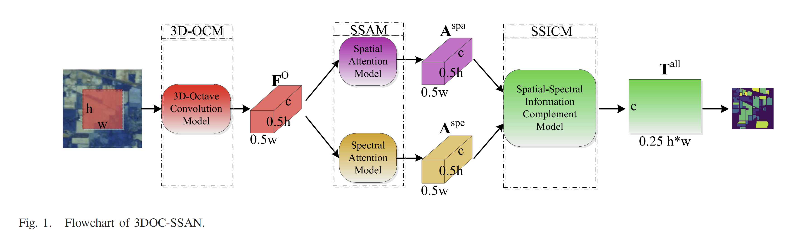

# 3DOC-SSAN-PyTorch
PyTorch implementation of paper [Hyperspectral Image Classification Based on 3-D
Octave Convolution With Spatial–Spectral
Attention Network](https://ieeexplore.ieee.org/document/9140029)

## Requirements  
To install requirements  
``
conda env create -f environment.yml
``
## Preprocess dataset
#### Simple example on Pavia University dataset  
Download Pavia University dataset and move it to ./datasets/Pavia_University/  
``
python ./datasets/data_process_pavia_university.py
``
## Training
``
python ./train.py
``
## Result
### Result in Pavia University Dataset
|  Metric  | Reported      | Our Implementation |
|----------|---------------|--------------------|
|  OA      | 99.87 ± 0.08% | 99.81%             |
|  AA      | 99.85 ± 0.15% | 99.82%             |     
|  Kappa   | 99.82 ± 0.16% | 99.74%             |     
## Acknowledgements
[3DOC-SSAN-TensorFlow-Official](https://github.com/smallsmallflypigtang/Hyperspectral-Image-Classification-Based-on-3D-Octave-Convolution-with-Spatial-Spectral-Attention)